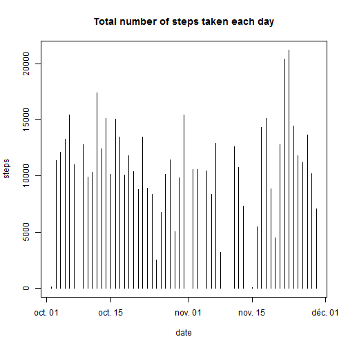
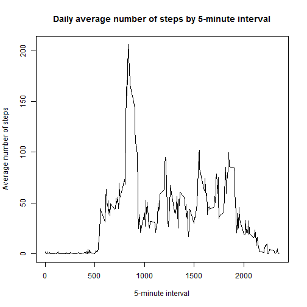
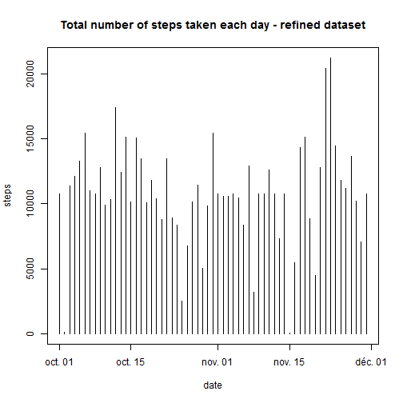
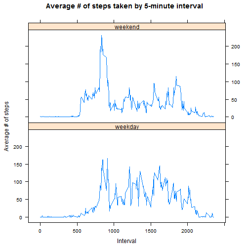

# Reproducible Research: Peer Assessment 1

## Introduction
Goal of this analysis: Analyzing data about personal movement using activity monitoring devices.

The data analyzed consists of two months of data from an anonymous individual collected during the months of October and November, 2012 and include the number of steps taken in 5 minute intervals each day.

The variables in this dataset used for analysis are:

* **steps**: Number of steps taking in a 5-minute interval (missing values are coded as `NA`)

* **date**: The date on which the measurement was taken in YYYY-MM-DD format

* **interval**: Identifier for the 5-minute interval in which measurement was taken

for a total of 17,568 observations.

This R Markdown document performs and documents the analytic steps required to perform such analysis.

## Loading and preprocessing the data


```r
################################################################################
# Function: get_raw_data
################################################################################
# DESCRIPTION:  Download raw data zip file from the web and unzip it
# INPUT:        
#       rawData --> File to be downloaded
#       fileURL --> URL from which the raw data file can be downloaded
################################################################################
get_raw_data <- function(rawData = "activity_data.zip", fileURL) {
        
        setInternet2(TRUE)  # set the R_WIN_INTERNET2 to TRUE
        
        dataDIR         <- "./data"
        logFileName     <- "README.txt" #paste(rawData, ".log", sep="")

        # Create directory if it does not exist
        if(!file.exists(dataDIR)){
                writeLines("INFO: Data directory created")
                dir.create("data")
        }

        # Connect to log file
        logFilePath     <- paste(dataDIR, "/", logFileName, sep="")
        logFileConn     <- file(logFilePath, open="w")
        
        # Set Raw file path
        dataRawFilePath <- paste(dataDIR,"/",rawData, sep="")

        # Set file URL
        fileUrl <- "https://d396qusza40orc.cloudfront.net/repdata%2Fdata%2Factivity.zip"

        # Download File
        writeLines("INFO: Downloading File")
        download.file(fileUrl, dataRawFilePath, method = "auto")

        # Writing info about downloaded file
        writeLines(paste("Raw Data File Name:", rawData), logFileConn)
        writeLines(paste("Raw Data File URL:", fileUrl), logFileConn)
        writeLines(paste("Date last accessed:", Sys.time()), logFileConn)
        close(logFileConn)
        
        # Un-zip file
        writeLines("INFO: Unzipping File")
        unzip(zipfile = dataRawFilePath, exdir = dataDIR)        
}
```

Raw data is downloaded from the web, stored in 'data' folder and unzipped.
Download information (File name, URL, Date last accessed) can be found in README.txt

### Getting data

```r
# Calling get_raw_data function
get_raw_data()
```

```
## INFO: Downloading File
## INFO: Unzipping File
```

### Loading file

```r
# Loading csv file in a dat.frame
rawData <- read.csv("data/activity.csv")
# returning data.frame structure
str(rawData)
```

```
## 'data.frame':	17568 obs. of  3 variables:
##  $ steps   : int  NA NA NA NA NA NA NA NA NA NA ...
##  $ date    : Factor w/ 61 levels "2012-10-01","2012-10-02",..: 1 1 1 1 1 1 1 1 1 1 ...
##  $ interval: int  0 5 10 15 20 25 30 35 40 45 ...
```

### Pre-processing the Data
1. Convert date variable datatype from Factor to Date

```r
rawData$date <- as.Date(rawData$date , format = "%Y-%m-%d")
```

## Analyzing ##
### What is mean total number of steps taken per day?
Ignoring the missing values in the dataset, we want to analyze the mean total number of steps taken per day

#### Histogram of the total number of steps taken each day


```r
# Aggreggating data: Sum of steps by day
aggDataByDay <- with(rawData, aggregate(steps ~ date, FUN=sum))
# Plotting data
with(aggDataByDay, plot(date, steps, type="h", main = "Total number of steps taken each day"))
```

 

#### **mean** and **median** total number of steps taken per day

* Mean:

```r
# Calculate mean on aggregated data ignoring NAs
mean(aggDataByDay$steps, na.rm = TRUE)
```

```
## [1] 10766
```
* Median:

```r
# Calculate median on aggregated data ignoring NAs
median(aggDataByDay$steps, na.rm = TRUE )
```

```
## [1] 10765
```

## What is the average daily activity pattern?

#### Time series plot of the 5-minute interval and the average number of steps taken, averaged across all days


```r
# Aggreggating data: Mean of steps by interval
aggDataByInterval <- with(rawData, aggregate(steps ~ interval, FUN=mean))
names(aggDataByInterval)[2] <- "avgSteps"
        
# Plotting data
with(aggDataByInterval, plot(interval, avgSteps, type="l", main = "Daily average number of steps by 5-minute interval", xlab="5-minute interval", ylab="Average number of steps"))
```

 

#### Which 5-minute interval, on average across all the days in the dataset, contains the maximum number of steps?


```r
aggDataByInterval[which.max(aggDataByInterval$avgSteps),1]
```

```
## [1] 835
```

## Imputing missing values

#### Total number of missing values in the dataset (i.e. the total number of rows with `NA`s)


```r
nrow(subset(rawData, steps ='NA'))
```

```
## [1] 17568
```

#### Strategy for filling in all of the missing values in the dataset:
        --> Using the mean for the interval as a replacement when missing value


```r
# Merging rawData with already calculated means by Interval, by interval
refinedData <- merge(rawData, aggDataByInterval, by="interval")

# If NA, then overwrite column 2 (steps) content by column 4 content (avgSteps)
refinedData[is.na(refinedData$steps),2] <- refinedData[is.na(refinedData$steps),4]

# get rid of column 4 (avgSteps)
refinedData$avgSteps<- NULL

str(refinedData)
```

```
## 'data.frame':	17568 obs. of  3 variables:
##  $ interval: int  0 0 0 0 0 0 0 0 0 0 ...
##  $ steps   : num  1.72 0 0 0 0 ...
##  $ date    : Date, format: "2012-10-01" "2012-11-23" ...
```
A new dataset called refinedData having the same variables than the rawData dataset has been created.

### Inspecting differences

#### Histogram of the total number of steps taken each day for the refined dataset


```r
# Aggreggating data: Sum of steps by day
aggDataByDay <- with(refinedData, aggregate(steps ~ date, FUN=sum))
# Plotting data
with(aggDataByDay, plot(date, steps, type="h", main = "Total number of steps taken each day - refined dataset"))
```

 

#### **mean** and **median** total number of steps taken per day for the refined dataset

* Mean:

```r
# Calculate mean on aggregated data ignoring NAs
mean(aggDataByDay$steps, na.rm = TRUE)
```

```
## [1] 10766
```
* Median:

```r
# Calculate median on aggregated data ignoring NAs
median(aggDataByDay$steps, na.rm = TRUE )
```

```
## [1] 10766
```

**Impact:** Mean and median are now equal.

## Are there differences in activity patterns between weekdays and weekends?

#### Creating a new factor variable (dayType) in the dataset with two levels -- "weekday" and "weekend" indicating whether a given date is a weekday or weekend day.


```r
################################################################################
# Function: isWeekEnd()
################################################################################
# DESCRIPTION:  Return TRUE if day is in weekend
# INPUT:        
#       date --> Date to be checked
################################################################################
isWeekEnd <- function(date) {
        !(weekdays(as.Date(date)) %in% c('Saturday','Sunday'))
}

#make sure we use English date names
Sys.setlocale("LC_TIME", "English")
```

```
## [1] "English_United States.1252"
```

```r
# Set default to weekday for dayType variable 
refinedData$dayType <- "weekday"

# Identify weekend days calling the isWeekEnd() function
refinedData$dayType[isWeekEnd(refinedData$date)] <- "weekend"

# Changing the dayType variable to factor
refinedData$dayType <- as.factor(refinedData$dayType)

str(refinedData$dayType)
```

```
##  Factor w/ 2 levels "weekday","weekend": 2 2 1 2 1 2 1 2 2 1 ...
```
#### Time series plot of the 5-minute interval (x-axis) and the average number of steps taken, averaged across all weekday days or weekend days (y-axis)


```r
library(lattice)
```

```
## Warning: package 'lattice' was built under R version 3.0.3
```

```r
# Aggreggating data: Sum of steps by day
aggDataByDayType <- with(refinedData, aggregate(steps ~ dayType + interval, FUN=mean))
# Plotting data
with(aggDataByDayType,
        xyplot( steps ~ interval | dayType,
                layout=c(1,2),
                type="l",
                xlab = "Interval",
                ylab = "Average # of steps",
                main = "Average # of steps taken by 5-minute interval")
    )
```

 
